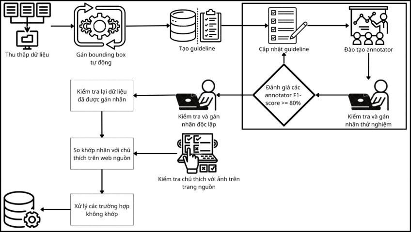
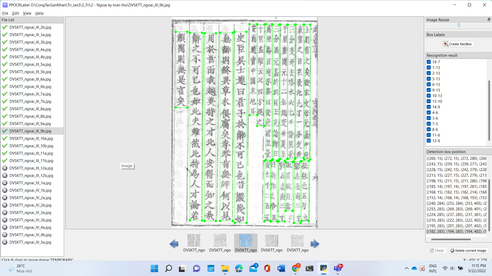
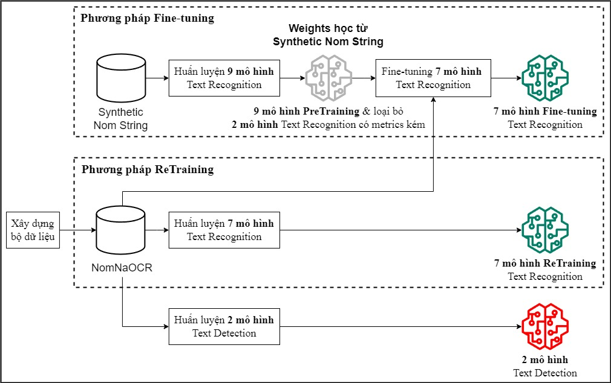
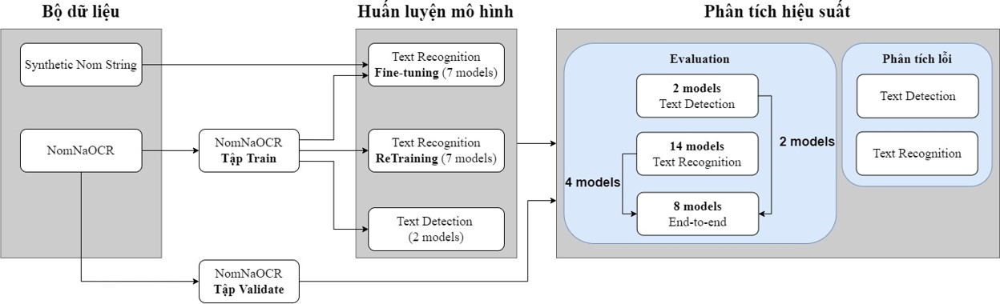
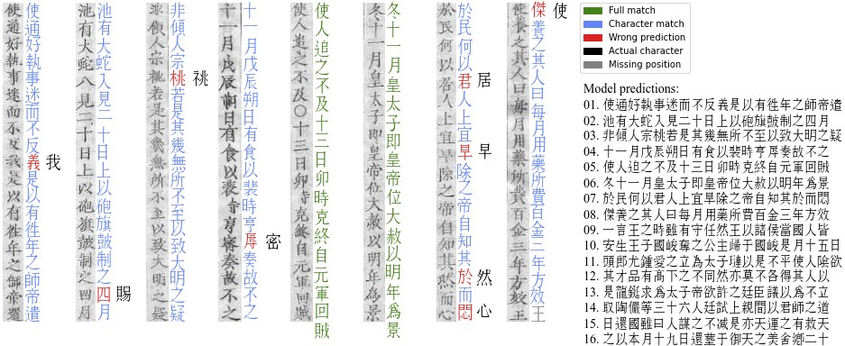
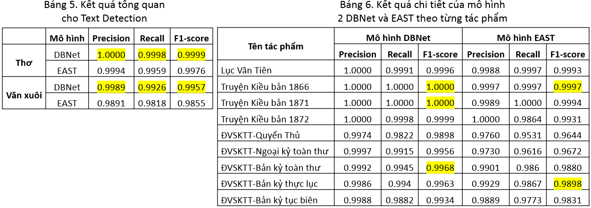
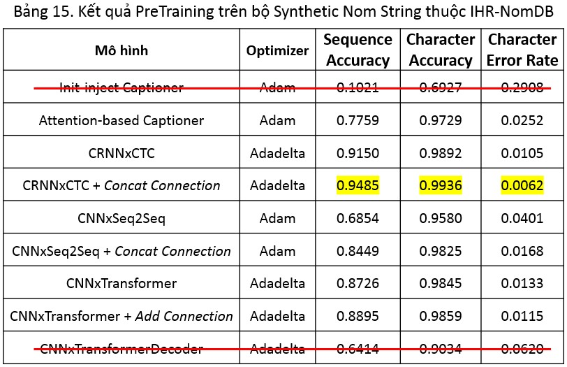
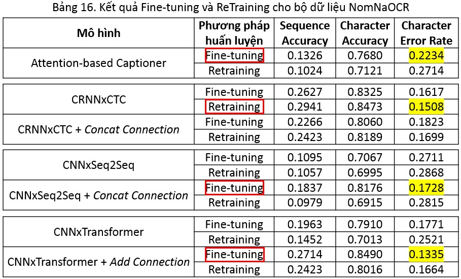
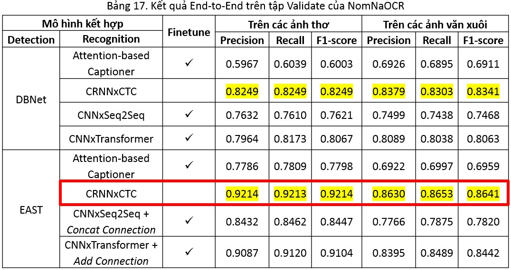

[English]() | Tiếng Việt

# Số hóa tài liệu lịch sử Việt Nam với Deep Learning

https://user-images.githubusercontent.com/50880271/195821293-367876c1-818d-40e9-b4b5-381d2fc831c3.mp4

- Audio: [ĐÀ LỊCH SỬ- Tóm tắt lịch sử Việt Nam - Từ Nguyễn Phương](https://youtu.be/1dwFsbbPJ80?t=686)
- Demo: https://share.streamlit.io/ds4v/nomnasite/main/app.py

## I. Tổng quan

### 1. Giới thiệu

Tiếng Việt diệu kì với ngữ âm cực kỳ phong phú cùng hệ thống chữ viết giàu mạnh nhất vùng Đông Á đã trải qua hành trình từ *chữ Nho* hay *chữ Hán* cho đến *chữ Nôm* và cuối cùng là *chữ Quốc Ngữ*. Đi cùng với mỗi loại chữ ấy là những trang sử vẻ vang của dân tộc. 

Sau khi kết thúc Nghìn năm Bắc thuộc, ông cha ta với ý thức tự chủ ngôn ngữ, đã sáng tạo ra [chữ Nôm](https://vi.wikipedia.org/wiki/Ch%E1%BB%AF_N%C3%B4m) dựa trên cơ sở chữ Hán được đọc theo âm Hán-Việt. Và đây cũng là công cụ duy nhất hoàn toàn ghi lại lịch sử văn hoá của dân tộc trong khoảng 10 thế kỷ. Tuy nhiên, di sản này hiện tại có nguy cơ tiêu vong.

<i>"Ngày nay, trên thế giới chưa có đến 100 người đọc được chữ Nôm. Một phần to tát của lịch sử Việt Nam như thế nằm ngoài tầm tay của 80 triệu người nói tiếng Việt."</i>

(Hội Bảo tồn di sản chữ Nôm Việt Nam – <a href="http://www.nomfoundation.org">VNPF</a>)

Để sử dụng nguồn tri thức khổng lồ này, chúng cần phải được số hóa và dịch sang Quốc Ngữ hiện đại. Do việc dịch thuật khó khăn và tốn nhiều thời gian cùng số lượng chuyên gia hạn chế nên các nổ lực này không thể thực hiện trong thời gian ngắn. 

👉 Để có thể tăng tốc quá trình số hóa này, các kỹ thuật về OCR chính là chìa khóa giúp mọi công trình chính trong Hán-Nôm thành sẵn có trực tuyến.

### 2. Các công việc đã thực hiện

Mình cùng người đồng đội [Nguyễn Đức Duy Anh](https://github.com/duyanh1909) đã thực hiện đề tài này trong gần 8 tháng dưới sự chỉ dẫn tận tình của TS. Đỗ Trọng Hợp ([Khoa KH&KTTT](https://fit.uit.edu.vn) - VNUHCM UIT) và đã thu được một số thành quả nhất định:

- Xây dựng thành công bộ dữ liệu [NomNaOCR](https://www.kaggle.com/datasets/quandang/nomnaocr):
  - Giải quyết 2 bài toán **Text Detection** và **Text Recognition** cho các tài liệu lịch sử viết bằng Hán-Nôm.
  - Có kích thước **lớn nhất Việt Nam hiện tại** với tổng cộng **2953 Page** và **38318 Patch**.
- Xây dựng thành công Pipeline cho các tác vụ OCR trên văn bản Hán-Nôm bằng phương pháp Deep Learning. 

  

- Cài đặt và thử nghiệm các mô hình trên **mức chuỗi** (Sequence level). Điều này chẳng những giúp tiết kiệm được chi phí gán nhãn mà còn giúp giữ lại được ngữ nghĩa trong câu thay vì chỉ thực hiện cho từng ký tự riêng lẻ như đa phần các công trình trước. Các bạn có thể xem qua các project open-source này nếu cần triển khai theo **mức kí tự** (Character level):
  - https://github.com/trhgquan/OCR_chu_nom
  - https://www.kaggle.com/competitions/kuzushiji-recognition

👉 Mọi người có thể xem thêm [bài viết](https://scale-ml.github.io/docs/OCR) của mình về OCR cũng như sơ lược các mô hình sử dụng trong project này hoặc có thể xem chi tiết hơn tại 2 file [thesis_vi.pdf](./thesis_vi.pdf) và [slide_vi.pptx](./slide_vi.pptx).

## II. Bộ dữ liệu [NomNaOCR](https://www.kaggle.com/datasets/quandang/nomnaocr)

**Lưu ý**: Các bạn nên sử dụng font [NomNaTong](http://www.nomfoundation.org/nom-tools/Nom-Font) để có thể đọc các nội dung Hán-Nôm 1 cách tốt nhất.

> Dataset: https://www.kaggle.com/datasets/quandang/nomnaocr

### 1. Quy trình thu thập dữ liệu

[VNPF](http://www.nomfoundation.org) đã số hóa cho rất nhiều tác phẩm Hán-Nôm nổi tiếng có giá trị lịch sử cao. Để có thể sử dụng được khối tài nguyên vô giá trên, mình sử dụng [Automa](https://www.automa.site) để tạo một [luồng thu thập tự động](./Data%20collection/workflow.json) gồm:
- Các hình ảnh lẫn URL của chúng.
- Các nội dung được phiên dịch gồm các ký tự Hán-Nôm kỹ thuật số và phần dịch Quốc Ngữ của chúng (nếu có).

https://user-images.githubusercontent.com/50880271/195821433-59c35cec-af04-4706-9aa9-a71b000e39a4.mp4

#### a. Hướng dẫn thu thập

> Khâu này mình không viết code nên có làm hơi thủ công tí 😅.

- Import file [workflow.json](./Data%20collection/workflow.json) vào [Automa](https://www.automa.site).
- Chọn thẻ `New tab` và chọn `Edit` => nhập URL của các tác phẩm Hán-Nôm cần thu thập.
- `Edit` trường `To number` của thẻ `Loop Data` để chỉ định số trang cần thu thập.
- `Edit` CSS Selector của các thẻ:
  - `Element exists`: kiểm tra trang rỗng.
  - `Blocks group`: lấy URL hình ảnh và nội dung của trang hiện tại.
- Bấm `Execute` để bắt đầu thu thập. 
- Chạy file [automa2txt.py](./Data%20collection/automa2txt.py) để parse file `automa.json` vừa có được sau khi thu thập thành 3 file:
  - `url.txt`: chứa các URL hình ảnh của tác phẩm.
  - `nom.txt`: chứa các text chữ Hán-Nôm.
  - `modern.txt`: chứa các phiên âm tương ứng với file `nom.txt`.

[*] Còn về phần download hình ảnh, mình chỉ đơn giản sử dụng tính năng Tải xuống hàng loạt của [Internet Download Manager](https://www.internetdownloadmanager.com/). Xem thêm video hướng dẫn [tại đây](https://youtu.be/UBItV0g25vQ).

#### b. Các tác phẩm đã thu thập

|         **Tên tác phẩm**        |     **Số lượng page**    |
| ------------------------------- |:------------------------:|
|     Lục Vân Tiên                |            104           |
|     Truyện Kiều bản 1866        |            100           |
|     Truyện Kiều bản 1871        |            136           |
|     Truyện Kiều bản 1872        |            163           |
|     ĐVSKTT Quyển Thủ            |            107           |
|     ĐVSKTT Ngoại kỷ toàn thư    |            178           |
|     ĐVSKTT Bản kỷ toàn thư      |            933           |
|     ĐVSKTT Bản kỷ thực lục      |            787           |
|     ĐVSKTT Bản kỷ tục biên      |            448           |
|     **Tổng cộng**               |         **2956**         |

[*] ĐVSKTT: Đại Việt Sử Ký Toàn Thư 

### 2. Quy trình gán nhãn

Nhóm mình sử dụng [PPOCRLabel](https://github.com/PaddlePaddle/PaddleOCR/blob/release/2.6/PPOCRLabel/README.md) thuộc hệ sinh thái của [PaddleOCR](https://github.com/PaddlePaddle/PaddleOCR) để gán tự động các `bounding box`. Tool này mặc định sử dụng [DBNet](https://github.com/MhLiao/DB) để phát hiện văn bản, đây cũng là mô hình nhóm mình sẽ thử nghiệm cho bài toán **Text Detection**. Ở đây, mình có phân tool này ra thành 2 bản:
- [annotators.zip](./Data%20labeling/PPOCRLabel/annotators.zip): dành cho người gán nhãn, mình đã bỏ đi các chức năng không cần thiết như `Auto annotation`, ... để tránh việc nhấn tùm lum có thể gây sai sót khi gán nhãn cũng như để việc cài đặt dễ dàng và ít lỗi hơn.
- [composer.zip](./Data%20labeling/PPOCRLabel/composer.zip): dành cho người xây dựng guideline (Mình sẽ gọi là **Composer**) dùng để chạy `Auto annotation`, khá đầy đủ chức năng so với bản gốc. Mình có bỏ đi thao tác *Auto recognition* khi chạy `Auto annotation` và sử dụng nhãn cho text là `TEMPORARY`. Ngoài ra, mình cũng đã thực hiện xoay ảnh lại để khớp với đầu vào các mô hình **Recognition** khi chạy chức năng `Export Recognition Result`.

👉 Các Annotator sẽ thay thế nhãn `TEMPORARY` theo hướng dẫn trong các guideline dành cho [thơ](./Data%20labeling/Guideline-poem.pdf) và cho [văn xuôi](./Data%20labeling/Guideline-prose.pdf). Cuối cùng là thực hiện [map nhãn thật](./Data%20labeling/mapping.py) được thu thập từ [VNPF](http://www.nomfoundation.org).

Tuy nhiên, với các ảnh trong [NomNaOCR](https://www.kaggle.com/datasets/quandang/nomnaocr) thì [PPOCRLabel](https://github.com/PaddlePaddle/PaddleOCR/blob/release/2.6/PPOCRLabel/README.md) đa phần sẽ phát hiện các vùng ảnh chứa văn bản theo chiều ngang nên mình đã thực hiện quay ảnh theo các góc 90 độ để phù hợp với bài toán: 
- Tùy vào từng tác phẩm mà **Composer** sẽ chọn xoay +90 hay -90 độ hoặc cả 2 hướng.
- Chạy file [rotated_generator.py](./Data%20labeling/Auto%20annotation/rotated_generator.py) để sinh các ảnh tương ứng.
- Sau đó đưa ảnh vào [PPOCRLabel](https://github.com/PaddlePaddle/PaddleOCR/blob/release/2.6/PPOCRLabel/README.md) để dự đoán các `bounding box`. 
- Khi dự đoán xong, chạy file [unrotated_convertor.py](./Data%20labeling/Auto%20annotation/unrotated_convertor.py) để xoay dọc các `bounding box` lại.

Sau khâu triển khai thực tế, bộ dữ liệu [NomNaOCR](https://www.kaggle.com/datasets/quandang/nomnaocr) được xử lý và thu được **2953 Page** (đã bỏ đi 1 Page scan lỗi và 2 Page trống). Bằng cách gán nhãn bán thủ công, nhóm mình đã thu được thêm **38318 Patch**. Tiếp theo, nhóm mình sử dụng [công thức](./Data%20splitting/IHRNomDB_Rs.py) từ bộ dữ liệu [IHR-NomDB](https://morphoboid.labri.fr/ihr-nom.html) để [chia dữ liệu Recognition](./Data%20splitting/split_patches.py) 1 cách hiệu quả nhất. Phần **Synthetic Nom String** thuộc bộ dữ liệu này cũng được dùng để thực hiện **Pretraining** cho các mô hình **Recognition**.

|   **Tập dữ liệu**   | **Số điểm dữ liệu** | **Tỉ lệ ký tự giao nhau** |
|:-------------------:|:-------------------:|:-------------------------:|
|       Tập Train     |         30654       |           93.24%          |
|     Tập Validate    |         7664        |           64.41%          |

## III. Triển khai mô hình

### 1. Quy trình huấn luyện

- Với Detection mình sử dụng [PaddleOCR](https://github.com/PaddlePaddle/PaddleOCR) để huấn luyện với các file config tương ứng trong folder [Text detection](./Text%20detection/).
- Với Recognition, trong quá trình **PreTraining** trên bộ **Synthetic Nom String** của [IHR-NomDB](https://morphoboid.labri.fr/ihr-nom.html), mình nhận thấy khi thực hiện **Skip Connection** (SC) cho **feature map** với 1 lớp **X** có cùng shape và nằm xa nó nhất sẽ cải thiện đáng kể hiệu suất mô hình. Vì vậy, mình có thử nghiệm 2 phương pháp **Skip Connection** cơ bản là **Addition** và **Concatenation** cho các mô hình khả thi nhất (tồn tại lớp **X** nói trên).

👉 Download weights của các mô hình [tại đây](https://drive.google.com/file/d/1lzFX4llRK-e18a95Lg4plXoSgjXXgzL5/view?usp=sharing).

### 2. Quy trình đánh giá

- Metrics đánh giá Text Detection và End-to-End: sử dụng 1 phương pháp mới tên là [CLEval](https://github.com/clovaai/CLEval) giúp đánh giá hiệu quả cho cả 2 giai đoạn phát hiện và nhận dạng văn bản (End-to-End). Ngoài ra, phương pháp này cũng có thể đánh giá được cho riêng Text Detection nên tùy vào bài toán mà [CLEval](https://github.com/clovaai/CLEval) sẽ có sự khác nhau trong các thành phần tính toán của nó.
- Metrics đánh giá cho riêng Text Recognition: sử dụng các phương pháp tương tự với các công trình trước đó bao gồm: **Sequence Accuracy**, **Character Accuracy** và **Character Error Rate** (CER).
- Ngoài ra, với Recognition mình chỉ giữ lại output của những `notebook` hay mô hình có kết quả tốt nhất trên tập **Validate** của [NomNaOCR](https://www.kaggle.com/datasets/quandang/nomnaocr) gồm: 
  - [CRNNxCTC.ipynb](./Text%20recognition/CRNNxCTC/CRNNxCTC.ipynb): có **Sequence Accuracy** cao nhất.
  - [SC-CNNxTransformer_finetune.ipynb](./Text%20recognition/TransformerOCR/SC-CNNxTransformer_finetune.ipynb): có **Character Accuracy** và **CER** cao nhất.

  

👉 Xem thêm [thesis_vi.pdf](./thesis_vi.pdf) và [slide_vi.pptx](./slide_vi.pptx) để biết thêm thông tin chi tiết.

## IV. Kết quả thực nghiệm

  
<h3 style="display:inline">1. <a href="./Text%20detection/CLEval.ipynb">Text Detection</a></h3>

  
  

  
<h3 style="display:inline">2. Text Recognition</h3>

  
  #### a. Kết quả PreTraining

  
  #### b. Kết quả Fine-tuning và ReTraining

  

  
<h3 style="display:inline">3. <a href="./E2E_eval.ipynb">End-to-End</a></h3>

  
  

## V. Trân trọng cảm ơn

- Các bạn trong team gán nhãn, những người đã hào phóng hy sinh một phần thời gian biểu để tham gia vào nghiên cứu cũng như giúp nhóm có thể hoàn thành bộ dữ liệu thật tốt, từ đó góp phần biến đề tài này thành hiện thực:

  | Thành viên (KHDL - VNUHCM UIT)                                                    | Email                  | GitHub                                      |
  |-----------------------------------------------------------------------------------|------------------------|---------------------------------------------|
  | [Ngô Đức Vũ](https://www.facebook.com/ngovu2.0)                                   | 20520950@gm.uit.edu.vn | [vungods](https://github.com/vungods)              |
  | [Trịnh Thế Hiển](https://www.facebook.com/hien.trinhthe.98)                       | 20521310@gm.uit.edu.vn | [HienTheTrinh](https://github.com/HienTheTrinh)         |
  | [Phan Châu Thắng](https://www.facebook.com/phanchauthang)                         | 20520929@gm.uit.edu.vn |                                             |
  | [Nguyễn Hùng Trung Hiếu](https://www.facebook.com/profile.php?id=100010696068136) | 20521323@gm.uit.edu.vn | [hellofromtheothersky](https://github.com/hellofromtheothersky) |
  | [Châu Tấn](https://www.facebook.com/TomatoFT)                                     | 20520926@gm.uit.edu.vn | [TomatoFT](https://github.com/TomatoFT)             |
  | [Nguyễn Minh Trí](https://www.facebook.com/profile.php?id=100010288122956)        | 20522052@gm.uit.edu.vn |                                             |
  | [Phạm Phú Phước](https://www.facebook.com/profile.php?id=100010066906493)         | 18521031@gm.uit.edu.vn |                                             |

- Bạn [Nguyễn Ngọc Thịnh](https://www.facebook.com/TanyaNguyen99) (Đông Phương học - VNUHCM USSH) đã giúp mình giải đáp những thắc mắc liên quan đến chữ Hán-Nôm trong đề tài này.

- Thầy [Nguyễn Đạt Phi](https://www.facebook.com/datphi.nguyen), người sáng lập kênh [HÙNG CA SỬ VIỆT](https://www.youtube.com/c/%C4%90%E1%BA%A0TPHIMEDIAOFFICIAL) đã truyền cho mình ngọn lửa tình yêu với lịch sử dân tộc, cũng như là nguồn cảm hứng đưa mình đến với đề tài này. Những câu chuyện về cha ông được kể lại qua giọng đọc truyền cảm của thầy đã trở thành món ăn tinh thần không thể thiếu.

- Cuối cùng, xin chân thành cảm ơn [VNPF](http://www.nomfoundation.org) vì những công trình tuyệt vời, góp phần bảo tồn di sản lịch sử và văn hóa dân tộc.

## VI. TODO

- [ ] [NomNaOCRpp](https://github.com/ds4v/NomNaOCRpp): Thử nghiệm các mô hình hiện đại hơn hay các mô hình SOTA trên các bộ dữ liệu benchmark nổi tiếng như ICDAR [2013](https://paperswithcode.com/dataset/icdar-2013) và [2015](https://paperswithcode.com/dataset/icdar-2015).
- [ ] [NomNaNMT](https://github.com/ds4v/NomNaNMT): Phát triển bài toán dịch máy để dịch các phiên âm Hán-Nôm sang Tiếng Việt.
- [ ] [NomNaSite](https://github.com/ds4v/NomNaSite): Xây dựng WebApp để ứng dụng các bài toán đã triển khai vào thực tế.
- [ ] Sử dụng **Beam search** hay xa hơn nữa là **Language model** để giải mã đầu ra (decode) cho **Text Recognition**, tham khảo từ các project của [Harald Scheidl](https://github.com/githubharald).
- [ ] Ghi nhận lại các lỗi trên [VNPF](http://www.nomfoundation.org) vào 1 file. Trong quá trình làm dataset, nhóm mình có phát hiện 1 vài lỗi trong phần dịch của [VNPF](http://www.nomfoundation.org) như 1 số phần dịch không khớp với Page hiện tại, chữ dịch sai so với hình, dịch thừa chữ hoặc thiếu chữ, .... Sau đây là 1 vài ví dụ:

  |                 Miêu tả lỗi                 |       Tác phẩm       | Trang | Vị trí trong ảnh |                             Ghi chú                            |
  |:-------------------------------------------:|:--------------------:|:-----:|:----------------:|:--------------------------------------------------------------:|
  | Chữ 揆 trong từ điển không có nghĩa "cõi"   | Truyện Kiều bản 1866 |   1   |       Câu 1      |                                                                |
  | Chữ 別 khác trong hình                      | Truyện Kiều bản 1866 |   9   |      Câu 22      | Dị thể với chữ 别, đa phần các version từ 1902 về trước đều bị |
  | Chữ 𥪞 khác trong hình                      | Truyện Kiều bản 1866 |   55  |      Câu 15      |                                                                |
  | Chữ 󰁳 khác trong hình                       | Truyện Kiều bản 1866 |   55  |      Câu 15      |                                                                |
  | Có 21 câu > 20 trong ảnh                    | Lục Vân Tiên         |   6   |         -        |                                                                |
  | Có 19 câu < 20 trong ảnh                    | Lục Vân Tiên         |   7   |         -        |                                                                |
  | Chữ thứ 5 bị hiển thị [?]                   | Lục Vân Tiên         |   7   |      Câu 10      |                                                                |

## VII. Tham khảo

- Sách [Đắm mình vào học sâu](https://d2l.aivivn.com/) được dịch bởi nhóm Dịch thuật Việt Nam.
- Các bài viết về OCR của anh [Phạm Bá Cường Quốc](https://pbcquoc.github.io).
- Series [Optical Character Recognition](https://theailearner.com/optical-character-recognition) của [TheAILearner](https://theailearner.com).
- Các bài viết về OCR của [Nanonets](https://nanonets.com):
  -   [Deep Learning Based OCR for Text in the Wild](https://nanonets.com/blog/deep-learning-ocr)
  -   [Building Custom Deep Learning Based OCR models](https://nanonets.com/blog/attention-ocr-for-text-recogntion).
  -   [How to easily do Handwriting Recognition using Machine Learning](https://nanonets.com/blog/handwritten-character-recognition).
  -   [ID Card Digitization and Information Extraction using Deep Learning - A Review](https://nanonets.com/blog/id-card-digitization-deep-learning).
- Các bài viết về OCR của [Label Your Data](https://labelyourdata.com):
  - Part 1 - [The Era of Digitization: Why Do the Automated Data Collection Systems Matter?](https://labelyourdata.com/articles/automated-data-collection)
  - Part 2 - [OCR Algorithms: Digitization of the Business Processes](https://labelyourdata.com/articles/automation-with-ocr-algorithm).
  - Part 3 - [OCR with Deep Learning: The Curious Machine Learning Case](https://labelyourdata.com/articles/ocr-with-deep-learning).
- Các bài viết về OCR của tác giả [Gidi Shperber](https://gidishperber.medium.com):
  - Part 1 - [A gentle introduction to OCR](https://towardsdatascience.com/a-gentle-introduction-to-ocr-ee1469a201aa).
  - Part 2 - [OCR 101: All you need to know](https://towardsdatascience.com/ocr-101-all-you-need-to-know-e6a5c5d5875b).
- Ngoài ra trong các file `*.ipynb` và `*.py` đều có chú thích nguồn tham khảo cho các tác vụ tương ứng.