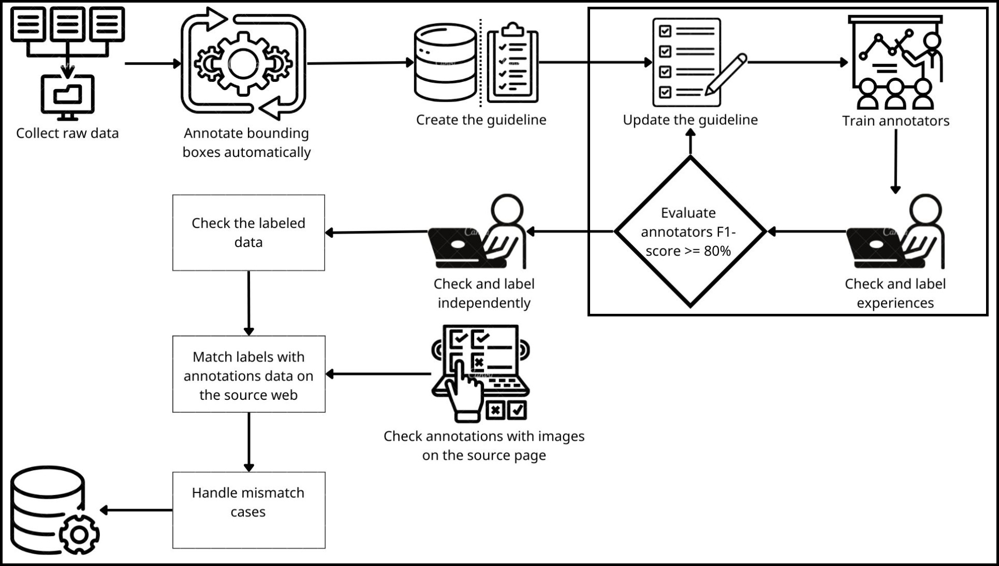
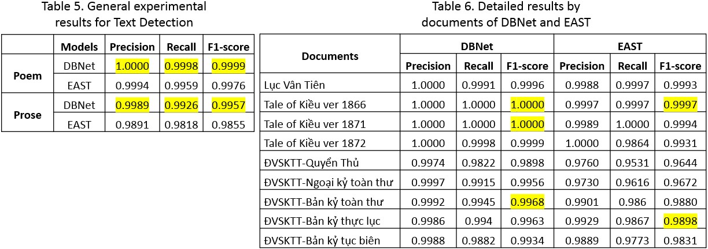
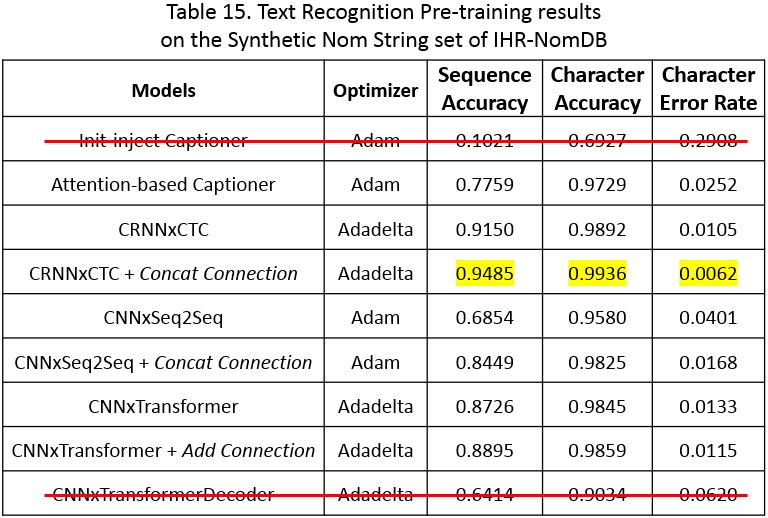
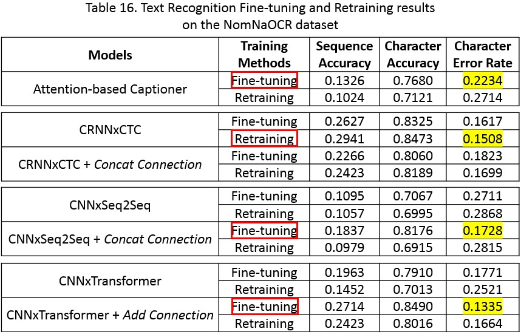
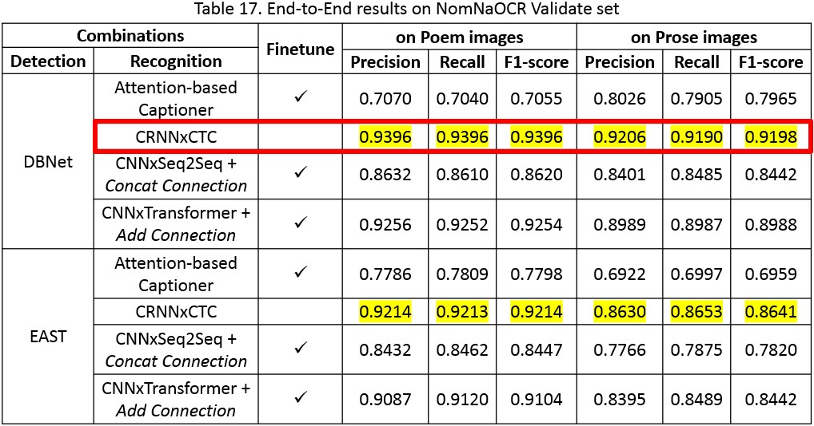
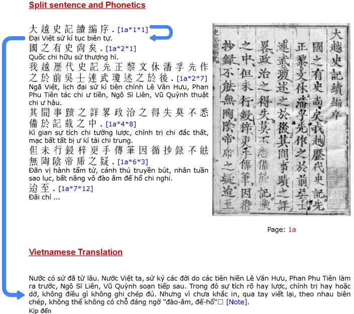

English | [Tiếng Việt](./README.md)

# Digitizing Vietnamese historical documents with DL

- Demo: https://youtu.be/o5xpfwalEWw
- Demo source: https://github.com/ds4v/NomNaSite

## I. Overview

### 1. Introduction

The Vietnamese language, with its extremely diverse phonetics and the most robust writing system in East Asia, has undergone a journey from *Confucian*, [*Sino (Hán)*](https://en.wikipedia.org/wiki/Ch%E1%BB%AF_H%C3%A1n) characters to the [*Nôm*](https://en.wikipedia.org/wiki/Ch%E1%BB%AF_N%C3%B4m) script, and finally, the [*Quốc Ngữ*](https://en.wikipedia.org/wiki/Vietnamese_alphabet) alphabet based on the Latin writing system. Accompanying each type of script are glorious chapters of the nation's history.

After ending Thousand Years of Chinese Domination, our ancestors, with a consciousness of linguistic self-determination, created the [Nôm](https://en.wikipedia.org/wiki/Ch%E1%BB%AF_N%C3%B4m) script, an ideographic script based on the Hán characters to represent Vietnamese speech. Along with these Hán characters, the [Nôm](https://en.wikipedia.org/wiki/Ch%E1%BB%AF_N%C3%B4m) script was used to record the majority of Vietnamese documents for about 10 centuries. However, this heritage is currently at risk of extinction by the shift to the modern Vietnamese script (Quốc Ngữ).

<i>"Today, less than 100 scholars world-wide can read Nôm. Much of Việt Nam's vast,  written history is, in effect, inaccessible to the 80 million speakers of the language"</i>

(Vietnamese Nôm Preservation Foundation – <a href="http://www.nomfoundation.org">VNPF</a>)

To use this vast source of knowledge, it needs to be digitized and translated into modern Quốc Ngữ. Due to the difficulty and time-consuming nature of translation, along with a limited number of experts, these efforts cannot be accomplished in a short time.

👉 To accelerate this digitization process, Optical Character Recognition (OCR) techniques are key to making all major works in **Sino-Nom** available online.

### 2. Achievements

My teammate [Nguyễn Đức Duy Anh](https://github.com/duyanh1909) and I have been working on this project for nearly 8 months under the dedicated guidance of Dr. Do Trong Hop ([Faculty of Information Science and Engineering](https://fit.uit.edu.vn) - VNUHCM UIT) and have obtained specific achievements:
- Successful build of the [NomNaOCR](https://www.kaggle.com/datasets/quandang/nomnaocr) dataset:
  - Serving 2 OCR problems of **Text Detection** and **Text Recognition** for historical documents written in Sino-Nom.
  - The **biggest dataset for Sino-Nom script** at the moment, with **2953 Pages** and **38318 Patches**.
- Successful build of an OCR pipeline on Sino-Nom text using Deep Learning.

  

- Implement and experiment models on **sequence level**. This not only saves the cost for annotation but also helps us retain the semantics in the sequence, instead of just processing individual character like most previous works. Take a look at the following open-source projects if you need implementations on **character level**:
  - https://github.com/trhgquan/OCR_chu_nom
  - https://www.kaggle.com/competitions/kuzushiji-recognition

👉 You can take a look at this [thesis_en.pdf](./thesis_en.pdf) file for a summary of the models used in this project.

## II. The [NomNaOCR](https://www.kaggle.com/datasets/quandang/nomnaocr) Dataset

- Dataset: https://www.kaggle.com/datasets/quandang/nomnaocr
- Paper: https://ieeexplore.ieee.org/document/10013842

**Note**: You should use the [NomNaTong](http://www.nomfoundation.org/nom-tools/Nom-Font) font to be able to read the Sino-Nom content in the best way.

### 1. Data Collection Process

[VNPF](http://www.nomfoundation.org) has digitized many famous Sino-Nom works with high historical value. To make use of these invaluable resources, I used [Automa](https://www.automa.site) to create an [automatic collection flow](./Data%20collection/workflow.json) to collect:
- Images and their URLs.
- Phonetics with their digital characters and Vietnamese translation (if any).

https://user-images.githubusercontent.com/50880271/195821433-59c35cec-af04-4706-9aa9-a71b000e39a4.mp4

#### a. Collection Instructions

> I was lazy to write code at this step, so I did it a bit manually 😅.

- Import [workflow.json](./Data%20collection/workflow.json) into [Automa](https://www.automa.site).
- Choose the `New tab` block and `Edit` => enter the URLs of the Sino-Nom works you want to collect
- `Edit` the `To number` field of the `Loop Data` block to specify the number of pages to be collected.
- `Edit` CSS Selector of following blocks:
  - `Element exists`: check if the page is empty.
  - `Blocks group`: get the image URL and the text of the current page.
- Click `Execute` to start collecting. 
- Run [automa2txt.py](./Data%20collection/automa2txt.py) to parse the obtained `automa.json` into 3 files:
  - `url.txt`: contains the image URLs of the historical work.
  - `nom.txt`: contains Sino-Nom text.
  - `modern.txt`: contains the translated phonetics corresponding to `nom.txt`.

[*] For downloading images, I just simply use the Batch Download feature of [Internet Download Manager](https://www.internetdownloadmanager.com/).

#### b. Collected Historical Works

|         **Document Name**       |    **Number of Pages**   |
| ------------------------------- |:------------------------:|
|     Lục Vân Tiên                |            104           |
|     Tale of Kiều ver 1866       |            100           |
|     Tale of Kiều ver 1871       |            136           |
|     Tale of Kiều ver 1872       |            163           |
|     ĐVSKTT Quyển Thủ            |            107           |
|     ĐVSKTT Ngoại kỷ toàn thư    |            178           |
|     ĐVSKTT Bản kỷ toàn thư      |            933           |
|     ĐVSKTT Bản kỷ thực lục      |            787           |
|     ĐVSKTT Bản kỷ tục biên      |            448           |
|     **Total**                   |         **2956**         |

[*] ĐVSKTT: abbreviation of Đại Việt Sử Ký Toàn Thư (History of Greater Vietnam).

### 2. Labeling process

We used [PPOCRLabel](https://github.com/PaddlePaddle/PaddleOCR/blob/release/2.6/PPOCRLabel/README.md) from the [PaddleOCR](https://github.com/PaddlePaddle/PaddleOCR) ecosystem to assign `bounding boxes` automatically. This tool, by default, uses [DBNet](https://github.com/MhLiao/DB) to detect text, which is also the model we planned to experiment with for **Text Detection**. Here, we have divided this tool into 2 versions:
- [annotators.zip](./Data%20labeling/PPOCRLabel/annotators.zip): For labelers, I removed unnecessary features like `Auto annotation`, ... to avoid mistakes due to over-clicking during labeling and to make installation easier and less error-prone.
- [composer.zip](./Data%20labeling/PPOCRLabel/composer.zip): For guideline builders (who I'll call **Composer**) to run `Auto annotation`, with quite fully functional compared to the original [PPOCRLabel](https://github.com/PaddlePaddle/PaddleOCR/blob/release/2.6/PPOCRLabel/README.md). I removed the *Auto recognition* computation when running `Auto annotation` and used `TEMPORARY` as the label for text. Additionally, I also implemented image rotation to match the input of the **Recognition** models when running the `Export Recognition Result` feature.

👉 Annotators will replace the `TEMPORARY` labels according to the guidelines for [poetry](./Data%20labeling/Guideline-poem.pdf) and [prose](./Data%20labeling/Guideline-prose.pdf) guidelines. Finally, they will [map the actual labels](./Data%20labeling/mapping.py) collected from [VNPF](http://www.nomfoundation.org).

However, with images in [NomNaOCR](https://www.kaggle.com/datasets/quandang/nomnaocr), [PPOCRLabel](https://github.com/PaddlePaddle/PaddleOCR/blob/release/2.6/PPOCRLabel/README.md) will mainly detect text areas in horizontal orientation, so we rotated images at 90-degree angles to detect boxes:
- Depending on the documents, **Composers** chose to rotate the images by ±90 degrees or both directions.
- Run [rotated_generator.py](./Data%20labeling/Auto%20annotation/rotated_generator.py) to generate the rotated images.
- Then, input them into [PPOCRLabel](https://github.com/PaddlePaddle/PaddleOCR/blob/release/2.6/PPOCRLabel/README.md) to predict the `bounding boxes`.
- When the prediction is complete, run [unrotated_convertor.py](./Data%20labeling/Auto%20annotation/unrotated_convertor.py) to rotate the `bounding boxes` vertically again.

After the actual implementation, the [NomNaOCR](https://www.kaggle.com/datasets/quandang/nomnaocr) dataset obtained **2953 Pages** (excluding 1 error-scanned page and 2 blank pages). By semi-manually annotating, we got additional **38,318 patches** (1 Patch was ignored). Then, we used the [formula](./Data%20splitting/IHRNomDB_Rs.py) of the [IHR-NomDB](https://morphoboid.labri.fr/ihr-nom.html) dataset to acquire a similar distribution between the `Train` and `Validate` sets to [split the Recognition data](./Data%20splitting/split_patches.py). The **Synthetic Nom String** set of this dataset was also used to perform **Pretraining** for **Recognition** models.

|      **Subset**     | **Number of Records** | **Character Intersection** |
|:-------------------:|:---------------------:|:--------------------------:|
|       Train set     |          30654        |            93.24%          |
|     Validate set    |          7664         |            64.41%          |

## III. Approaches

### 1. Training Process

- For Detection, I used [PaddleOCR](https://github.com/PaddlePaddle/PaddleOCR) for training with corresponding config files in the [Text detection folder](./Text%20detection/).
- For Recognition, during the **PreTraining** phase on the **Synthetic Nom String** set of [IHR-NomDB](https://morphoboid.labri.fr/ihr-nom.html), we found that when performing **Skip Connection** (SC) for the **feature map** with a layer **X** that has the same shape and is located as far away from this **feature map** as possible, it will significantly improve model performance. Therefore, we also experimented 2 fundamental **Skip Connection** methods: **Addition** and **Concatenation** for the most feasible models (those contain the aforementioned layer **X**).

👉 Download the weights of models [here](https://drive.google.com/file/d/1GDUM3gO5hDBaicCbESf3G07XH5I3sx4k/view).

### 2. Evaluation Process

- Metrics for evaluating **Text Detection** and **End-to-End**: We used a new method called [CLEval](https://github.com/clovaai/CLEval) to evaluate the effectiveness of both stages of Text Detection and Recognition (End-to-End). Moreover, this method can also evaluate Text Detection only, so depending on the problem, [CLEval](https://github.com/clovaai/CLEval) will vary in its computational components.
- Metrics for evaluating **Text Recognition** only: We used similar metrics to previous related works at sequence level, including: **Sequence Accuracy**, **Character Accuracy**, and **Character Error Rate** (CER).
- Additionally, for **Recognition**, I only keep the output of `notebooks` or models that have the best results on the `Validate` set of [NomNaOCR](https://www.kaggle.com/datasets/quandang/nomnaocr), including:
  - [CRNNxCTC.ipynb](./Text%20recognition/CRNNxCTC/CRNNxCTC.ipynb): has the highest **Sequence Accuracy**.
  - [SC-CNNxTransformer_finetune.ipynb](./Text%20recognition/TransformerOCR/SC-CNNxTransformer_finetune.ipynb): has the highest **Character Accuracy** and **CER**.

  

👉 Check [thesis_en.pdf](./thesis_en.pdf) for more information.

## IV. Experimental Results

  
<h3 style="display:inline">1. Text Detection</a></h3>

  
  

  
<h3 style="display:inline">2. Text Recognition</h3>

  
  #### a. PreTraining results

  
  #### b. Fine-tuning and ReTraining results

  

  
<h3 style="display:inline">3. End-to-End</a></h3>

  
  

## V. Many Thanks to

- Members of the labeling team, who generously sacrificed a portion of their time to participate in this research and help us complete a high-quality dataset:

  | Members (VNUHCM UIT)                                                              | Email                  | GitHub                                      |
  |-----------------------------------------------------------------------------------|------------------------|---------------------------------------------|
  | [Ngô Đức Vũ](https://www.facebook.com/ngovu2.0)                                   | 20520950@gm.uit.edu.vn | [vungods](https://github.com/vungods)              |
  | [Trịnh Thế Hiển](https://www.facebook.com/hien.trinhthe.98)                       | 20521310@gm.uit.edu.vn | [HienTheTrinh](https://github.com/HienTheTrinh)         |
  | [Phan Châu Thắng](https://www.facebook.com/phanchauthang)                         | 20520929@gm.uit.edu.vn |                                             |
  | [Nguyễn Hùng Trung Hiếu](https://www.facebook.com/profile.php?id=100010696068136) | 20521323@gm.uit.edu.vn | [hellofromtheothersky](https://github.com/hellofromtheothersky) |
  | [Châu Tấn](https://www.facebook.com/TomatoFT)                                     | 20520926@gm.uit.edu.vn | [TomatoFT](https://github.com/TomatoFT)             |
  | [Nguyễn Minh Trí](https://www.facebook.com/profile.php?id=100010288122956)        | 20522052@gm.uit.edu.vn |                                             |
  | [Phạm Phú Phước](https://www.facebook.com/profile.php?id=100010066906493)         | 18521031@gm.uit.edu.vn |                                             |

- My friend, [Nguyễn Ngọc Thịnh](https://www.facebook.com/TanyaNguyen99) (Oriental Studies - VNUHCM USSH) for helping me answer questions about linguistic aspects of Sino-Nom characters in this project.
- Mr. [Nguyễn Đạt Phi](https://www.facebook.com/datphi.nguyen), the founder of the [HÙNG CA SỬ VIỆT](https://www.youtube.com/c/%C4%90%E1%BA%A0TPHIMEDIAOFFICIAL) channel, who has instilled in me a passion for our nation's history, which served as an inspiration for me to pursue this project. The stories about our ancestors, narrated with his emotive voice, have become an indispensable spiritual nourishment for me.
- Finally, heartfelt thanks to [VNPF](http://www.nomfoundation.org) for their wonderful works and contribution to the preservation of our national historical and cultural heritage.

## VI. TODO

- [ ] Use **Beam search** or even further, a Language model to decode the output for **Text Recognition**, referencing projects by [Harald Scheidl](https://github.com/githubharald).
- [ ] [NomNaOCRpp](https://github.com/ds4v/NomNaOCRpp): Experiment with more recent models or state-of-the-art (SOTA) models on famous benchmark datasets such as ICDAR [2013](https://paperswithcode.com/dataset/icdar-2013) and [2015](https://paperswithcode.com/dataset/icdar-2015).
- [x] [NomNaSite](https://github.com/ds4v/NomNaSite): Develop a WebApp to apply implemented solutions in practical scenarios.
- [ ] [NomNaNMT](https://github.com/ds4v/NomNaNMT): Develop the following 2 machine translation tasks.
  - [x] Translate Sino-Nom phonetics into Quốc Ngữ script: Already deployed by [HCMUS](https://www.clc.hcmus.edu.vn/?page_id=3039).
  - [ ] From the above Quốc Ngữ text, further translate into contemporary Vietnamese.

  

- [ ] Record errors on [VNPF](http://www.nomfoundation.org) into a file. During dataset creation, we discovered several errors in [VNPF](http://www.nomfoundation.org)'s translations, such as some translations not matching the current Page, incorrect translations compared to the image, translations with extra or missing words, ... Below are a few examples:

  |                   Error Description                    |          Work         | Page | Location in Image |                               Note                                |
  |:------------------------------------------------------:|:---------------------:|:----:|:-----------------:|:-----------------------------------------------------------------:|
  | The character 揆 in the dictionary does not mean "cõi" | Tale of Kieu ver 1866 |   1  |     Sentence 1    |                                                                   |
  | The character 別 is different from the image           | Tale of Kieu ver 1866 |   9  |    Sentence 22    |      Variant of "别", appeared mostly in versions before 1902     |
  | The character 𥪞 is different from the image           | Tale of Kieu ver 1866 |  55  |    Sentence 15    |                                                                   |
  | The character 󰁳 is different from the image            | Tale of Kieu ver 1866 |  55  |    Sentence 15    |                                                                   |
  | There are 21 lines > 20 in the image                   | Lục Vân Tiên          |   6  |         -         |                                                                   |
  | There are 19 lines < 20 in the image                   | Lục Vân Tiên          |   7  |         -         |                                                                   |
  | The 5th character is displayed as [?]                  | Lục Vân Tiên          |   7  |    Sentence 10    |                                                                   |

## VII. References

- [Dive into Deep Learning](https://d2l.ai/index.html) book.
- OCR articles by [Phạm Bá Cường Quốc](https://pbcquoc.github.io).
- OCR articles by [TheAILearner](https://theailearner.com/optical-character-recognition).
- OCR articles by [Nanonets](https://nanonets.com):
  -   [Deep Learning Based OCR for Text in the Wild](https://nanonets.com/blog/deep-learning-ocr)
  -   [Building Custom Deep Learning Based OCR models](https://nanonets.com/blog/attention-ocr-for-text-recogntion).
  -   [How to easily do Handwriting Recognition using Machine Learning](https://nanonets.com/blog/handwritten-character-recognition).
  -   [ID Card Digitization and Information Extraction using Deep Learning - A Review](https://nanonets.com/blog/id-card-digitization-deep-learning).
- OCR articles by [Label Your Data](https://labelyourdata.com):
  - Part 1 - [The Era of Digitization: Why Do the Automated Data Collection Systems Matter?](https://labelyourdata.com/articles/automated-data-collection)
  - Part 2 - [OCR Algorithms: Digitization of the Business Processes](https://labelyourdata.com/articles/automation-with-ocr-algorithm).
  - Part 3 - [OCR with Deep Learning: The Curious Machine Learning Case](https://labelyourdata.com/articles/ocr-with-deep-learning).
- OCR articles by [Gidi Shperber](https://gidishperber.medium.com):
  - Part 1 - [A gentle introduction to OCR](https://towardsdatascience.com/a-gentle-introduction-to-ocr-ee1469a201aa).
  - Part 2 - [OCR 101: All you need to know](https://towardsdatascience.com/ocr-101-all-you-need-to-know-e6a5c5d5875b).
- Additionally, in `*.ipynb` and `*.py` files, there are references noted for the corresponding implementations.